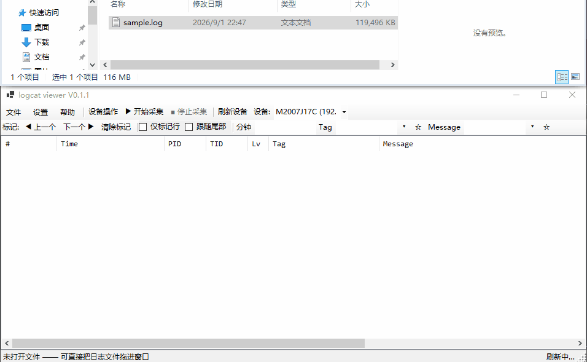

# logcat viewer

[](logcat.csproj)
[](LICENSE)
[](#requirements)
[](https://github.com/daitouniao/logcat-viewer/actions/workflows/ci.yml)

A Windows desktop viewer for Android logs (`logcat`). Built with WinForms on .NET 10, it opens **tens of millions of log lines instantly** using memory-mapped files and a columnar index — and it also drives your device over ADB: live capture, screenshots, screen recording, two-pane file transfer, and APK install/uninstall.

**English** | [简体中文](README.zh-CN.md)

Repositories:

- GitCode (primary): <https://gitcode.com/gcw_WDXl5paK/logcat-viewer>
- GitHub (mirror): <https://github.com/daitouniao/logcat-viewer>

> Current version **V0.1.3**. The single source of truth is `<Version>` in [logcat.csproj](logcat.csproj) — the window title, the about dialog and the exe's file properties all read from it.
>
> The UI speaks **both Chinese and English** and switches at runtime — `Help → Language`, no restart. First launch follows your system locale; the choice is remembered in `settings.json`.



## Log viewing

Most logcat viewers choke on large captures. This one keeps the text on disk (mmap) and only the fixed-width columns in memory, so a multi-GB log file opens without loading it into RAM and scrolls at a stable frame rate.

| Capability | How it works |
| --- | --- |
| **Instant open on huge files** | Memory-mapped + parallel block indexing, with a cancellable progress bar |
| **Virtual list** | Only visible rows are rendered, so scrolling stays smooth at 10M+ rows |
| **Six formats auto-detected** | `threadtime` / `time` / `long` / `brief` / `tag` / `ymd`, via a byte-level fast path with regex fallback |
| **Multi-line joining** | Stack traces and wrapped messages fold back into their parent record (toggleable) |
| **Level colours** | V/D/I/W/E/F/A colour-coded |
| **Full record view** | Double-click a row (`Enter`) to see the untruncated original text |
| **Incremental reload** | `F5` re-reads only the appended tail, with line-boundary alignment across batch edges |

## Filtering

- **Level**: freely toggle V/D/I/W/E/F/A, with select-all / clear-all shortcuts
- **Tag / Message**: `or` / `and` combination, case-sensitivity, exclude mode
- **PID / TID**: multiple values space-separated, excludable
- **Minute**: filter by the timestamp's minute value, e.g. `05 20`
- **Marked rows only**
- **Auto-apply**: refreshes 400 ms after you stop typing; `Ctrl+Enter` applies manually
- **Detached filter window**: the filter panel lives in a non-modal window that floats above the main window, so the entire main area is left to the log list. Closing it only collapses it — your filter conditions survive. Reopen via `Ctrl+F`
- **Saved filters**: separate favourites for Tag and Message, up to 60 each, persisted

## Marking and export

- Press `M` (or double-click the line-number column) to mark/unmark; `F2` / `Shift+F2` jump between marks
- Right-click to filter directly by that tag / PID / TID / minute
- Export the current result, or only marked rows; optional "single-line" mode (newlines become `\n`) for spreadsheets
- Copy as raw text or as tab-separated table rows

## ADB device features

Toolbar provides live capture, device operations, and save:

| Feature              | Description                                                                                                                                                                                                                                                                            |
| -------------------- | -------------------------------------------------------------------------------------------------------------------------------------------------------------------------------------------------------------------------------------------------------------------------------------- |
| Refresh devices      | Enumerates online devices; hot-plug is monitored automatically                                                                                                                                                                                                                         |
| Start / stop capture | Streams `logcat` to a temp file and syncs incrementally into the list, following the tail. Capture and filtering/export are mutually excluded on the document (serialised access), and pure tail appends only re-filter the new rows — per-second cost drops from O(total) to O(added) |
| Save log             | Saves the current capture as a `.log` file                                                                                                                                                                                                                                             |
| Device operations    | One drop-down entry point (screenshot / screen record / file browser / install-uninstall APK / command window), all merged into a single tabbed "Device operations" window                                                                                                             |

## Device operations window

Screenshots, screen recording, file browsing, APK install/uninstall and the command window are merged into one non-modal, singleton window with tabs. Tabs are created lazily on first open and keep their state; switching devices rebuilds device-bound tabs automatically; closing the window cleans up (stops recording, cancels command tasks, writes options back).

### Screenshot / Screen record / File browser

**Screenshot & record**: preview and save, or pull the recording to your PC.

**File browser**: a two-pane device ↔ PC file manager with:
- Transfer, refresh, directory favourites, and rename
- Restricted directories such as `/data/data` need root (toolbar run-as button acts as a mode drop-down)
- Transfers tolerate files being in use
- Drag-and-drop preserves relative structure
- `sync` is issued after upload so data survives an unplug

### Install / uninstall APK

- **Two install channels**
  - `adb install` with optional `-r` (keep data, on by default), `-d` (allow downgrade), `-g` (grant all permissions), `-t` (allow test packages)
  - `pm install` as a fallback when `adb install` is disabled — pushes the APK to a device temp directory (default `/data/local/tmp`) and cleans up afterwards
- **Two uninstall channels**: `adb uninstall` or `pm uninstall`, with optional `-k` (keep data and cache); the `pm` channel can run as root via `su -c`, which uninstalling system apps usually requires
- **Installed app list**: pulls third-party apps on connect (name / package / APK path), double-click or `Enter` to uninstall
- **Favourites** for local APK paths and package names; options are remembered between sessions

### Command window

Collect the commands you keep retyping, organise them into categories, and re-run them on the selected device (`Ctrl+Shift+C`).

- **Two execution channels**
  - *Device shell* — via `adb shell`; when root is ticked it is wrapped as `su -c '...'` with POSIX single-quote escaping
  - *Local adb* — calls `adb.exe` directly for subcommands like `install` / `reboot` / `push`, automatically appending `-s <serial>`, and reports the exit code
- **Categories**: 112 built-in commands across 5 categories (`shell`, `dumpsys`, apps & packages, logs & exceptions, `adb`); create / rename / delete your own
- **Favourites and history**: up to 300 favourites deduplicated by command text + channel; execution history keeps the last 120 with usage counts
- **Placeholder parameters**: any `{name}` in a command (letters/digits/`_`/`-`) is prompted for before execution, and the last value is remembered. The built-in library uses `{pkg}`, `{pid}`, `{file}`, `{path}`, `{activity}`, `{url}`, `{tag}`, `{ip}`, `{apk}`, `{name}`; `{pkg}` also falls back to your run-as favourites as the default
- **Streaming output**: line-by-line echo with line count and elapsed time; long-running commands like `logcat` can be stopped or time out (default 30 s, 0 = unlimited)
- **No accidental runs**: double-click or `Enter` only fills the input box; you still have to press Execute

## User experience

### Window position memory (multi-monitor)

The main window's position, size and state are saved on close and restored on next launch — including which monitor it was on, for both horizontally and vertically arranged displays. If that monitor is no longer connected, the saved geometry fails validation and the app falls back to the default layout instead of restoring off-screen.

Verification: `Log\startup.log` (next to the exe) records the screen topology, the coordinates read, the validation result, the actual landing position, and the coordinates written on close.

### High-DPI support

The 12 hand-written dialogs under `Forms/` declare `AutoScaleMode.Dpi` and scale with the system DPI, so button text is no longer clipped on high-scaling displays. The app font follows the UI language — Microsoft YaHei UI for Chinese, which fixes the missing-CJK-glyph problem that made Chinese text render as clipped glyphs under GDI font fallback at high DPI; Segoe UI for English.

Multi-monitor with different scaling (e.g. primary 150%, secondary 100%):
- Filter window height auto-adjusts to content after showing
- Toolbar row heights use AutoSize instead of fixed heights
- Dropdown widths clamp to minimum to keep buttons visible
- DpiFix dynamically expands TableLayoutPanel rows and fixed-height button bars that would otherwise overflow

Verification: DPI measurements and fallback actions are logged to `Log\startup.log` (next to the exe) `[DPI]` section.

### Bilingual UI (Chinese / English)

The entire UI is available in both languages and switches **at runtime** — no restart.

- **Switching**: `Help → Language → 简体中文 / English`; the choice is persisted to `settings.json`
- **Default**: first launch follows the system locale (`CultureInfo.CurrentUICulture`); a corrupt or missing setting falls back to it
- **What gets re-measured on switch**: not just text. The whole UI is built in code (`frmMain.Designer.cs` is 37 lines), so switching re-walks every open form and applies the target language's font — Microsoft YaHei UI for Chinese (Segoe UI has no CJK glyphs and clips them at high DPI), Segoe UI for English — then re-measures fixed-width buttons and absolutely-positioned dialogs, which are ~30–50% wider in English
- **Scope**: 556 translated strings across 9 tables, plus per-language fixed widths for columns and dialogs

A language layout audit walks the control tree in both languages at minimum / default / half width and asserts **zero clipped labels**.

## Requirements

**To run a published build — Windows is all you need.** Every release ships two builds; pick
the one that fits your machine:

| Build | Target machine | Size |
|---|---|---|
| `logcat-V<version>-win-x64.zip` | **Windows only** — unzip and run, nothing to install | ~120 MB |
| `logcat-V<version>-win-x64-fd.zip` | Needs [.NET 10 Desktop Runtime](https://dotnet.microsoft.com/download/dotnet/10.0) installed first | ~1.8 MB |

Not sure? Take the self-contained one — it is the larger download but zero setup.

- **Windows x64** (10 or later)
- **`adb`** on your `PATH` — only for the device features (live capture, screenshots, file
  transfer, APK install). The app starts the ADB server itself if it isn't running. Everything
  else (opening and filtering log files) works without it.

**To build from source:** .NET 10 SDK (`net10.0-windows`, WinForms).

## Build and run

```powershell
dotnet build                # build
dotnet run                  # run
dotnet publish -c Release   # publish (framework-dependent, ~1.8 MB; see docs/BUILDING.md)
```

You can also open `logcat.slnx` / `logcat.csproj` directly in Visual Studio.

> Pre-built binaries are shipped alongside every release. Download them from either Release page:
> - GitCode: <https://gitcode.com/gcw_WDXl5paK/logcat-viewer/releases>
> - GitHub: <https://github.com/daitouniao/logcat-viewer/releases>
>
> Build from source only when you need a custom configuration (trim dependencies, change default paths, sign the binary, etc.).

## Tests

Log parsing, the columnar index (including incremental append and line-boundary alignment), the filter
engine, the persistence stores and the localization tables are covered by xUnit tests. The UI and
device/system-integration layers are intentionally excluded from the coverage scope.

```powershell
# run the suite
dotnet test tests/logcat.Tests/logcat.Tests.csproj

# run with coverage (coverlet -> cobertura), then render a readable report
dotnet test tests/logcat.Tests/logcat.Tests.csproj --collect:"XPlat Code Coverage" --settings tests/logcat.Tests/coverlet.runsettings
python tests/coverage-report.py     # writes tests/coverage-report.html
```

Current status: **412 tests, all passing**; **99.38%** line coverage (2,226 / 2,240 lines), **87.56%** branch coverage (1,028 / 1,174 branches).

The scope is defined in `tests/logcat.Tests/coverlet.runsettings` and excludes two groups:

- **UI layer** — `Forms` / `Controls` / `frmMain` / `Program`, plus `DpiFix` / `DpiDiag` / `Loc`: WinForms construction and layout depend on a message pump and STA threads, so unit-testing them is costly and low-value. `Loc` is excluded for the same reason as `DpiFix` — half of it is control-tree walking, font swapping and pixel measurement, which only mean something against a real form. Its sibling `LocTable.*` (pure data translation tables) is **kept in scope** and is guarded by 18 `LocTableTests` assertions, including source scans that catch untranslated strings.
- **Device / system integration layer** — `AdbManager` (needs a real adb server and device), `LogcatStream` (device stream), `ClipboardHelper` (Windows clipboard), `StartupLog` (writes into the user profile).

> In a restricted sandbox (some IDE-managed terminals) the test host may be denied writes to `%TEMP%`, which
> fails many tests. Point the temp directory into the workspace instead:
> `TMP=<dir inside the repo> TEMP=<same> dotnet test ...`.

## Keyboard shortcuts

| Shortcut          | Action                                                 |
| ----------------- | ------------------------------------------------------ |
| `Ctrl+O`          | Open a log file                                        |
| `F5`              | Reload (incremental; skipped if the file is unchanged) |
| `Ctrl+E`          | Export current result                                  |
| `Ctrl+Enter`      | Apply filter                                           |
| `Ctrl+F`          | Open the filter window and focus the Message box       |
| `Ctrl+C`          | Copy selected rows                                     |
| `Ctrl+Shift+C`    | Open the command window                                |
| `F2` / `Shift+F2` | Previous / next mark                                   |
| `F3` / `Shift+F3` | Find next / previous in results                   |
| `M`               | Mark the current row                                   |
| `Enter`           | View the full record for the current row               |
| `Esc`             | Stop the current task and clear the selection          |
| `Ctrl+Q`          | Quit                                                  |

You can also drag a log file straight onto the window.

## Filter syntax

- Separate multiple keywords with spaces: `crash anr`
- Wrap phrases in double quotes: `"null pointer"`
- The `or` / `and` drop-down decides how multiple terms combine (both Tag and Message default to `or`)
- The term boxes are colour-coded: **background** shows the match relation (`or` blue / `and` orange), **text colour** turns dark red when case-sensitivity is on. An empty box stays uncoloured
- The toolbar and the filter dialog mirror each other: type in either one and both update
- Tick *exclude* to drop matches

## Project structure

```
Program.cs              Entry point
frmMain.cs              Main window: layout, dual toolbars, filter panel, ADB entry points, shortcuts
app.ico                 Application icon (referenced in csproj ApplicationIcon)
Controls/
  LogListView.cs        Virtual-mode log list (columns, level colours, marks, view snapshots)
  FilePane.cs           File pane base class (navigation, list rendering, favourites, rename, drag-drop)
  DeviceFilePane.cs     Device-side file pane
  LocalFilePane.cs      Local-side file pane
Forms/
  DeviceOpsDialog.cs    Device operations: screenshot / record / file browser / APK / command merged into tabs
  FileBrowserDialog.cs  Device ↔ local two-pane file manager (file browser tab in DeviceOpsDialog)
  ApkInstallDialog.cs   APK install (adb install / pm install, path favourites)
  ApkUninstallDialog.cs APK uninstall (installed app list, package name favourites)
  FilterDialog.cs       Detached filter window (hosts the main window's filter panel)
  CommandDialog.cs      Command window (categories, favourites, history, execution, output)
  CommandEditDialog.cs  New / edit favourite command
  ScreenShotDialog.cs   Screenshot tab (in DeviceOpsDialog)
  ScreenRecordDialog.cs Screen record tab (in DeviceOpsDialog)
  RecordDialog.cs       Single record detail pop-up
  RunAsDialog.cs        Run-as package name selector
  SimpleInputBox.cs     Simple input dialog
Models/
  FilterSpec.cs         Filter conditions
  DeviceInfo.cs         Device information
  FileEntry.cs          File entry
  FavoriteDir.cs        Favourite directory
  CommandEntry.cs       Favourite command / execution record / channel enum
Services/
  Loc.cs                Localization runtime (resource keys, binding, font swap, per-language width fitting)
  LocTable.*.cs         Translation tables split by area (Common / MainUi / FilterUi / FileUi / ApkUi / DeviceUi / CommandUi / CommandWindow / RuntimeMsg)
  DpiDiag.cs            High-DPI layout diagnostics (writes to startup.log [DPI] section)
  DpiFix.cs             High-DPI layout fallback (expands overflowing TLP rows and fixed-height button bars)
  StartupLog.cs         Startup diagnostic log (exe-relative `Log\startup.log`)
  LogDocument.cs        Columnar index document (mmap, parallel indexing, incremental reload)
  LogParser.cs          Line parser (six formats + continuation detection)
  FilterEngine.cs       Filter engine (pre-filter → message match → export)
  AdbManager.cs         ADB wrapper (device enumeration, shell, streaming, local adb, screenshot, push/pull)
  LogcatStream.cs       Live logcat capture stream
  ClipboardHelper.cs    Clipboard write with retry (other processes briefly holding the clipboard shouldn't throw ExternalException)
  FavoritesStore.cs     Favourites persistence (directories, run-as packages, APK paths, app packages, tag/message filter conditions)
  CommandStore.cs       Command categories / favourites / history persistence + built-in command library
  AppSettings.cs        User-level settings (window geometry, display options, last paths, UI language, install/uninstall options; JSON in exe-relative `settings.json`)
  AppInfo.cs            Product name and version (reads Assembly InformationalVersion)
tests/
  coverage-report.py    Coverage report generation (coverlet cobertura XML → readable HTML)
  logcat.Tests/         xUnit test project (412 tests: log parsing / columnar index / filter engine / persistence / localization)
    coverlet.runsettings Coverage scope (Include / Exclude rules)
docs/
  BUILDING.md            How to build and publish — the two `dotnet publish` commands, artifact verification, pitfall table
  TESTING.md             How to run the suite and produce coverage (single entry point)
  UT-AUDIT.md            Mutation-testing audit — where the tests actually bite
  FEATURES.md            Planned features (stub)
  FILTER-REFACTOR-PLAN.md   Toolbar-filter / filter-panel decoupling plan (executed, kept for the record)
  TOOLBAR-FAVORITES-DESIGN.md  Toolbar star-favourites + favourites dropdown, final design (shipped, kept for the record)
  images/main.gif        The demo animation at the top of this file
LICENSE                 Apache-2.0 full text
THIRD-PARTY-NOTICES.md  Third-party licences
DISCLAIMER.md           Disclaimer full text
```

## Documentation

| Document | When to read it |
|---|---|
| [docs/BUILDING.md](docs/BUILDING.md) | Building or publishing — the two `dotnet publish` commands, artifact verification, pitfall table |
| [docs/TESTING.md](docs/TESTING.md) | Running the suite or producing coverage — includes the workaround for `dotnet test` failing inside a restricted sandbox |
| [docs/UT-AUDIT.md](docs/UT-AUDIT.md) | Whether the tests actually bite — the mutation-testing audit |
| [THIRD-PARTY-NOTICES.md](THIRD-PARTY-NOTICES.md) | Dependencies and licences — per-package versions, licences, copyright lines and distribution checklist |
| [DISCLAIMER.md](DISCLAIMER.md) | The full terms to read before using the tool |

## Data storage

- User settings (window position/size/state, continuation merging, auto-apply, font size, newline visibility, **UI language**, last browse paths, install/uninstall options) are persisted as JSON to `settings.json` (next to the exe)
- Favourites (device/local directories with aliases, run-as packages, APK paths, app packages, tag/message filter conditions; up to 60 per list, most-recent first) go to `favorites.json` (next to the exe)
- Command categories, favourites, history, and placeholder values go to `commands.json` (next to the exe, first open writes the built-in library)
- Live capture writes to `logcat_live_*.log` in the system temp directory, cleaned up on window close
- Multi-monitor window geometry is validated on each launch; if the saved monitor is no longer connected, the app falls back to default layout instead of restoring off-screen

## License

[Apache License 2.0](LICENSE). It was chosen to match the licences of the dependencies and toolchain: the only non-Microsoft dependency is the Apache-2.0 ADB client library and everything else is MIT, so Apache-2.0 covers the whole dependency tree without conflict and adds the patent grant. Free to use, modify and distribute under the Apache-2.0 terms, including commercially.

> The source was produced with AI assistance and is not attributed to a named individual author; copyright is declared collectively as `logcat viewer contributors`. To put your own attribution in place, change two places: the `Copyright` line in the `LICENSE` appendix and `<Copyright>` in `logcat.csproj`.

### Licence compatibility

| Used | Licence | Relationship to this project |
|---|---|---|
| AdvancedSharpAdbClient 3.6.16 | Apache-2.0 | The only non-Microsoft NuGet library; its DLL ships with the build → Apache-2.0 keeps things simplest |
| Microsoft.Extensions.* 10.0.11 (Logging and its dependencies, 13 packages) | MIT | MIT code can be incorporated into an Apache-2.0 project without restriction, keeping its copyright notice |
| .NET SDK 10.0.400 / C# compiler / WinForms | Source MIT; installed binaries under the Microsoft Software Licence — .NET Library | Build toolchain and runtime; the terms permit building and distributing applications for free |
| adb.exe (Android platform-tools) | Apache-2.0 | An external program in the user's environment — not bundled or modified; if you redistribute platform-tools, keep its LICENSE/NOTICE |

### Details and compliance

- The full inventory (package names, versions, licence identifiers, copyright lines, transitive dependencies, distribution checklist) is in [THIRD-PARTY-NOTICES.md](THIRD-PARTY-NOTICES.md).
- `dotnet build` / `dotnet publish` copy `README.md` (English), `README.zh-CN.md` (Chinese), `LICENSE`, `THIRD-PARTY-NOTICES.md` and `DISCLAIMER.md` into the output directory, so every binary release carries its own notices.
- Assembly copyright information is written into the exe's *Properties → Details*.

### Contributions are licensed as Apache-2.0

Per Apache-2.0 §5, contributions submitted to this repository are licensed under Apache-2.0 by default and need no separate declaration. When you modify a source file, note the modification there as required by §4(b).

## Disclaimer

See [DISCLAIMER.md](DISCLAIMER.md) for the full terms. Using this software means you have read, understood and agreed to all of them; **if you disagree with any of them, stop using it and delete it immediately.** In short:

- **Device operations are at your own risk** — screenshots, screen recording, file transfer, APK install/uninstall and `adb shell` / root commands act directly on your device; confirm what each command does. Loss of data, system instability or device damage caused by a mistake is borne by you, the operator.
- **root and restricted directories** — accessing `/data/data` and similar requires root or run-as, and may damage app data or affect your warranty
- **Lawful use only** — only on devices and data you are authorised to access
- **Logs contain sensitive data** — logcat output often includes credentials, tokens and location data; sanitise before sharing
- **Not an official tool** — not affiliated with Google, Android or the ADB team
